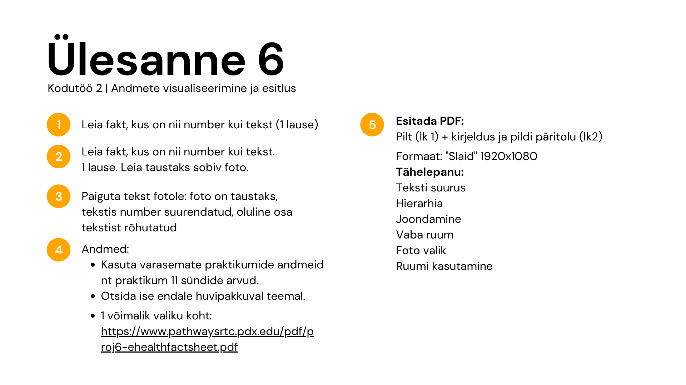
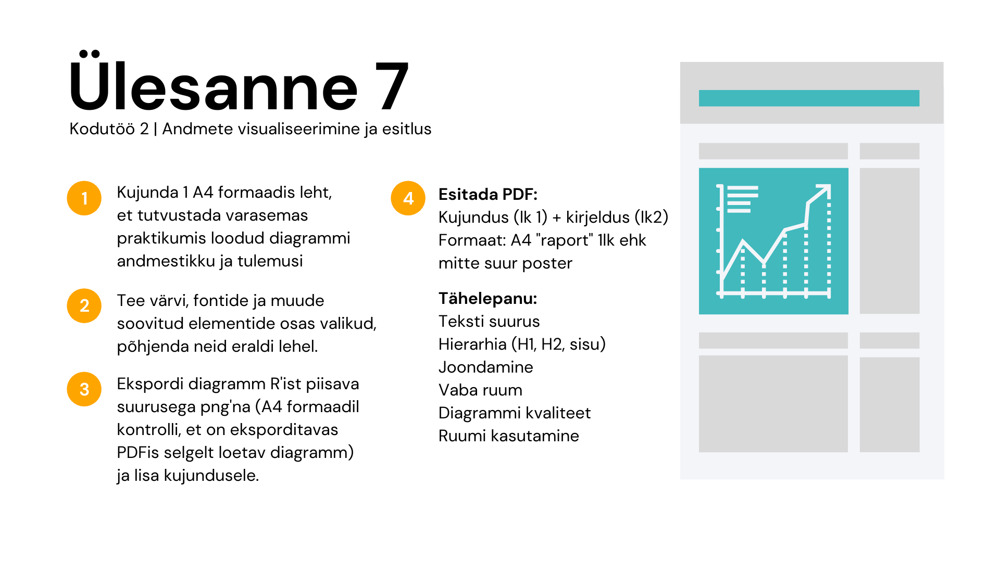

## Kodutöö esitamise õpetus

Iga ülesande lahendus peaks mahtuma ühte või mitmesse koodiaknasse, selle ülesande all. See kood võiks olla nii kirjutatud, et saaks käima tõmmata ilma mõtlemata. See tähendab, et kõik vajalikud lisapaketid ja andmestikud loetakse sisse vastavas koodiaknas.

Kahe viimase ülesande lahendused, mille puhul R kood pole vajalik, tuleks esitada lihtsalt samas zip kataloogis eraldi failina. Sellesse faili võib kirjutada õige faili nime mida vaadata.

Esita kogu kodutöö kataloog zip failina lehel <https://courses.cs.ut.ee/2021/dataviz/spring/Main/Homework>. Tähtaeg on **10. mai 23.59 EET**.

## Ülesanne 1

Teil tuleb noorem sugulane Tartusse ülikooli ja pole siin linnas kunagi käinud. Tehke talle üks väljaprinditav kaart, kus on teie arvates olulisemad asjad välja toodud (näiteks, õppehooned, ühika ümbruse poed, parimad lõbustusasutused, kõige olulisemad tänavad, ...). Mõned asjad võiks kindlasti olla näidatud ka nimega. Kaart võiks olla visuaalselt puhas ja kena välja näha, nii et nimed oleks loetavad ja ei kattu, ei ole mingeid suvalisi teejuppe mis kuhugi ei vii. Kindlasti võiks peal olla ka jõgi.

```{r}
library(tidyverse)
library(sf)
library(osmdata)
library(leaflet)
library(ggrepel)
library(lwgeom)
```

```{r}
clean_osm_data = function(x, retain_named = F){
  for(i in names(x)){
    if(str_detect(i, "osm") & !is.null(x[[i]])){
      if(nrow(x[[i]]) == 0) { next} 
      if(retain_named){
        x[[i]] = x[[i]] %>% 
          filter(!is.na(name))
      }
      
      # res = x[[i]] %>% keep(~ mean(is.na(na_if(.x, ""))) < 0.2) 
      res = x[[i]] %>% keep(function(.x) if(is.list(.x)){return(T)} else {mean(is.na(na_if(.x, ""))) < 0.2} ) 
      if(("name" %in% colnames(x[[i]])) & (!("name" %in% colnames(res)))){
        name = x[[i]] %>% as.data.frame() %>% select(name) 
        res = res %>% bind_cols(name)
      }
      x[[i]] = res
    }
  }
  
  return(x)
}
```

```{r}
t_bb = getbb("Tartu kesklinn")

teed = opq(t_bb) %>% 
  add_osm_feature(key = "highway") %>% 
  osmdata_sf() %>% 
  unname_osmdata_sf()

vesi = opq(t_bb) %>% 
  add_osm_feature(key = "water") %>% 
  osmdata_sf() %>% 
  unname_osmdata_sf()

hooned = opq(t_bb) %>% 
  add_osm_feature(key = "building") %>% 
  osmdata_sf() %>% 
  unname_osmdata_sf() %>% 
  clean_osm_data()

park = opq(t_bb) %>% 
  add_osm_feature(key = "leisure", value = "park") %>% 
  osmdata_sf() %>% 
  unname_osmdata_sf()

asutused = opq(t_bb) %>% 
  add_osm_feature(key = "amenity") %>% 
  osmdata_sf() %>% 
  unname_osmdata_sf() %>% 
  clean_osm_data(retain_named = T)

t_teed = teed$osm_lines %>% 
  filter(!(highway %in% c("steps", "path", "footway", "cycleway", "service", "track")))

t_hooned = hooned$osm_polygons %>% bind_rows(hooned$osm_multipolygons)

t_asutused = asutused$osm_points %>% bind_rows(st_centroid(asutused$osm_polygons))

#linuxil vaja seda teha
st_crs(t_asutused) <- 4326

t_asutushooned = st_join(t_hooned, t_asutused)

t_asutushooned_p = t_asutushooned %>%
  st_centroid() %>% 
  bind_cols(st_coordinates(.) %>% as.data.frame())

t_asutushooned[ ,"Asutuse tüüp"] <- NA

t_asutushooned %>% 
  mutate(`Asutuse tüüp`=replace(`Asutuse tüüp`, addr.street == "Ujula" |
                                             addr.street == "Riia" & addr.housenumber == "1" |
                                             addr.street == "Raatuse" & addr.housenumber == 20|
                                             name.x == "Coop Kivi Konsum"|
                                             amenity == "marketplace"|
                                             name.x == "Grossi Toidukaubad"|
                                             addr.street == "Lembitu" & addr.housenumber == 2, "Toidupood"))

unique(t_asutushooned$`Asutuse tü`)

stf_f$clust4g[stf_f$stflife <= 5 & stf_f$stfeco < 5] <- 1

ggplot() +
  geom_sf(data = t_teed, color = "grey80") +
  geom_sf(data = t_asutushooned, fill = "gray60")+
  geom_sf(data = hooned$osm_polygons %>% filter(building == "dormitory"), fill = "red")+
  geom_sf(data = t_asutushooned %>% filter(name.y %in% c(
    "Johan Skytte poliitikauuringute instituut", 
    "Ühiskonnateaduste instituut",
    "Genoomika instituut",
    "Tartu ülikooli maailma keelte ja kultuuride kolledž",
    "Filosoofia ja semiootika instituut",
    "Eesti ja üldkeeleteaduse instituut",
    "Ajaloo ja arheoloogia instituut",
    "Molekulaar- ja rakubioloogia instituut",
    "Hambaarstiteaduse instituut",
    "Usuteaduskond",
    "Ökoloogia ja maateaduste instituut",
    "Arvutiteaduse instituut",
    "Matemaatika ja statistika instituut",
    "Majandusteaduskond",
    "kultuuriteaduste instituut"
    )), fill = "gold") + 
  geom_sf(data = t_asutushooned %>% filter(addr.street == "Ujula" |
                                             addr.street == "Riia" & addr.housenumber == "1" |
                                             addr.street == "Raatuse" & addr.housenumber == 20|
                                             name.x == "Coop Kivi Konsum"|
                                             amenity == "marketplace"|
                                             name.x == "Grossi Toidukaubad"|
                                             addr.street == "Lembitu" & addr.housenumber == 2), fill = "purple")+
  #geom_sf(data = t_asutushooned %>% filter(addr.street == "Riia" & addr.housenumber == "1"), fill = "purple")+ #Kaubamaja
  #geom_sf(data = t_asutushooned %>% filter(addr.street == "Raatuse" & addr.housenumber == 20), fill = "purple")+ #Selver
  #geom_sf(data = t_asutushooned %>% filter(name.x == "Coop Kivi Konsum"), fill = "purple")+
  #geom_sf(data = t_asutushooned %>% filter(amenity == "marketplace"), fill = "purple")+
  geom_sf(data = t_asutushooned %>% filter(name.x == "Tasku"), fill = "purple")+
  #geom_sf(data = t_asutushooned %>% filter(name.x == "Grossi Toidukaubad"), fill = "purple")+
  geom_sf(data = t_asutushooned %>% filter(name.x == "Zeppelin"), fill = "purple")+
  geom_sf(data = t_asutushooned %>% filter(name.x == "Kvartal"), fill = "purple")+
  #geom_sf(data = t_asutushooned %>% filter(addr.street == "Lembitu", addr.housenumber == 2), fill = "purple")+ #Kivi konsum
  geom_sf(data = t_asutushooned %>% filter(amenity %in% c("theatre", "cinema", "concert_hall")), fill = "pink")+ #kinod/teatrid
  geom_sf(data =   t_asutushooned %>% filter(name.x %in% c("AHHAA Teaduskeskus", "Aura veekeskus",  "Mänguasjamuuseum")), fill = "pink")+
  geom_sf(data = t_asutushooned %>% filter(amenity %in% c("pub", "bar", "cafe", "restaurant", "fast_food") & !(name.x %in% c("Kvartal", "Tartu linnaraamatukogu", "Üliõpilaselamu Pepleri 14", "Tartu Kaubamaja", "Tasku"))), fill = "#654321")+
  geom_sf(data = t_asutushooned %>% filter(amenity == "library"), fill = "orange")+
  geom_sf(data = asutused$osm_points %>% filter(amenity == "post_office"), fill = "turquoise")+
  geom_sf(fill = "#0077be", data = vesi$osm_multipolygons) +
  geom_sf(fill = "#138510", data = park$osm_multipolygons)+
  geom_sf(fill = "#138510", data = park$osm_polygons)+
  xlim(t_bb[1, ]) + 
  ylim(t_bb[2, ])+
  theme_void()+
  theme(plot.background = element_rect(fill = "grey50"))
```

## Ülesanne 2

Tehke samale sugulasele nüüd interaktiivne kaart. Kuna interaktiivne lahendus võimaldab sisse ja välja zoomida ning vajadusel täpsemat infot küsida, siis on võimalik panna peale rohkem infot. Lõpptulemusena võiks tekkida kaart millelt on võimalik leida kõik eluks vajalik. Sellele kaardil võiks olla vähemalt kolm kihti ja legend. Kindlasti tasub uurida ka erinevaid interaktiivseid võimalusi millest praksis ei jõudnud rääkida [<https://rstudio.github.io/leaflet/>](https://rstudio.github.io/leaflet/){.uri}.

## Ülesanne 3

Kasutades Spotify populaarsete lugude andmestikku (Koduülesandest 5). Tehke nüüd interaktiivne visualisatsioon samast võrgustikust. Sellel shiny rakendusel peaks olema vähemalt 3 erinevat kontrolli, millega parameetreid muuta. Tulemuseks saadav rakendus peaks olema ilusti vormistatud, kontrollid olema sisukad, pilt selge ning kergesti loetav.

## Ülesanne 4

Andmestikus `occupations.RData` on info erinevate inimeste, sugude, vanuste, palkade ja ametite kohta. Kasutades `shinydashboard`-i tehke üks näidikutahvel mis võimaldaks uurida erinevate ametite keskmist palka, arvutada seda vabalt valitud vanusevahemikele ning valida kas vaadata seda sugude kaupa eraldi või koos. Iga ameti jaoks võiks olla võimalus visualiseerida palga jaotust selle ameti esindajate hulgas. Võiks olla välja toodud ka vähemalt 2 dünaamilist ja sisukat väärtuste kasti.

## Ülesanne 5

Andmestikus `birth_year.RData` on aasta päevade kaupa toodud ära keskmine sündide arv USAs. Proovige ÜHE graafikuga näidata selles andmestikus midagi huvitavat. Vormistage graafik nii, et see iseseisvalt annaks edasi sõnumi. Järgige selle töö käigus SWD protsessi ja lisaks pildile kirjutage sammude 2-5 kohta mida te iga sammu puhul konkreetselt tegite.

## Ülesanne 6



## Ülesanne 7


