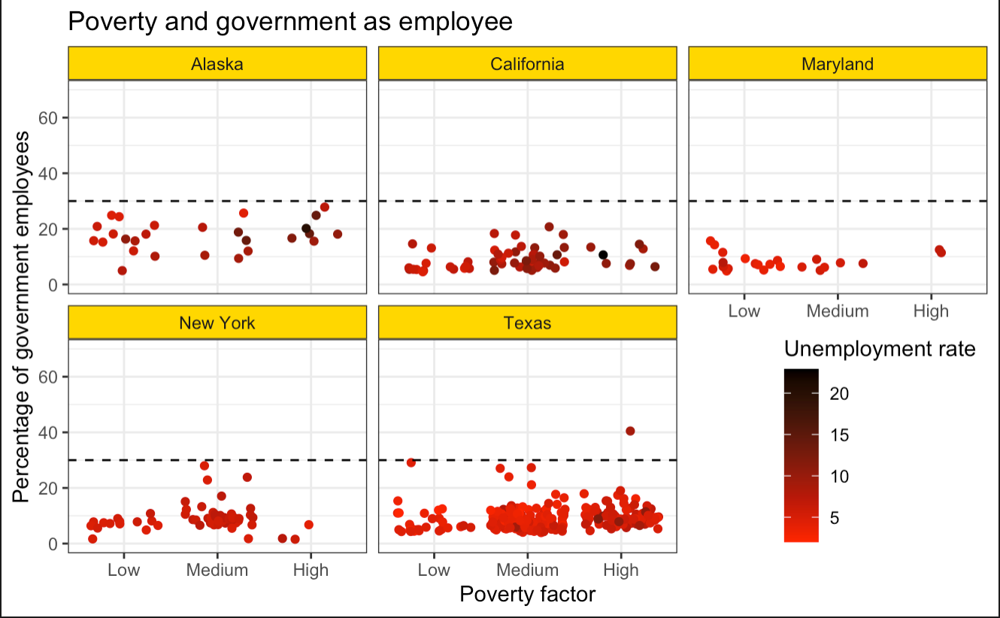

## Sissejuhatus

Selles selles ja järgmises praktikumis tutuvume paketiga ggplot2 mis implementeerib graafikute grammatika R-s. Selle praktikumi eesmärk on selgeks saada üldisem ggplot2 süntaks ning järgmises harjutame erinevat tüüpi andmetele mõistlike visualisatsioonide leidmisele. Enne kui läheme edasi tasub ggplot2 sisse lugeda.

```{r}
library(ggplot2)
library(tidyverse)
```

Lisaks tõmmake <https://courses.cs.ut.ee/2021/dataviz/spring> lehelt alla andmestik linnad.RData ja laadige see käsuga `load`.

```{r}
load("linnad.RData", verbose = T)
linnad
```

## Graafiku loomine ggplot2-ga

`ggplot2` puhul ei kasutata tavaliselt ühte suurt funktsiooni mis kogu pildi korraga valmis teeb. Selle asemel on ports funktsioone, millega erinevaid kihte saab defineerida ja pildi väljanägemist mõjutada. Esmane funktsioon millega pildi joonistamist alustada on `ggplot`. Selle argumentideks on andmestik ja soovitavalt ka seosed andmete ja graafiliste elementide vahel. Need seosed tuleb panna funktsiooni aes sisse, mis annb `ggplot2`-le teada, et nende tunnuste väärtused tuleb ära teisendada. Siin defineeritud tunnuste ja graafiliste esitusviiside soesed kanduvad edasi ka järgnevalt defineeritud konkreetsetesse kihtidesse.

```{r}
ggplot(linnad, aes(x = per_capita_inc, y = unemployment_rate))
```

Selleks et vastavaid operatsioone teostada, need liidetakse tehtega `+` olemasolevale pildi objektile. Kihte saab pildile lisada käskudega `geom_*`. Lisame pildile punktide kihi käsuga `geom_point`.

```{r}
ggplot(linnad, aes(x = per_capita_inc, y = unemployment_rate)) + 
  geom_point()
```

Punktidel on veel rida graafilisi atribuute, mida me saame ära kasutada andmete edasi andmiseks. Näiteks color, size ja shape on vastavalt värv, suurus ja kuju.

```{r}
ggplot(linnad, aes(x = per_capita_inc, y = unemployment_rate, color = bachelor)) + 
  geom_point()
```

```{r}
ggplot(linnad, aes(x = per_capita_inc, y = unemployment_rate, color = bachelor, shape = State)) + 
  geom_point()
```

#### Ülesanded

-   Joonista välja hajuvusdiagramm keskkooli ja ülikooli lõpetanute protsendi vahel (tunnused *high_scl* ja *bachelor*). Kas tunnuste vahel on seos?

-   Kujutada graafikul ka osariiki (tunnus *State*). Proovi selleks erinevaid variante. Kas haridustasemed on osariikide kaupa erinevad?

-   Kujuta graafikul ka maakonna rahvaarvu (tunnus *pop_estimate*), kasutades näiteks punkti suurust.

```{r}
ggplot(linnad, aes(x = high_scl, y = bachelor, color = State, size = pop_estimate)) + 
  geom_point()
```


## Geomeetrilised esitused

`ggplot2` defineerib loomulikult märgatavalt rohkem geomeetrilis esitusi, kui ainult punktid. Järgnevalt on toodud mõned tavalisemad.

-   Punktid: `geom_point`

-   Joon: `geom_line`

-   Tulp: `geom_bar`

-   Histogramm: `geom_histogram`

-   Karpdiagramm: `geom_boxplot`

-   Tekst: `geom_text`

Täielik ülevaade olemasolevatest vahenditest on lehel <https://ggplot2.tidyverse.org/reference/index.html>. Mõne uue geom-i kasutamisel tasub uurida ka abilehti, kus **Aesthetics** sektsioonis on kirjas millised parameetrid peab vastavale kujundile ette andma.

```{r}
ggplot(linnad, aes(x = perc_poverty)) +
  geom_histogram()
```

```{r}
ggplot(linnad, aes(x = Birth_factor, y = perc_poverty)) +
  geom_boxplot()
```

```{r}
ggplot(linnad, aes(x = Birth_factor)) +
  geom_bar()
```

#### Ülesanded

-   Joonista välja tunnuse *bachelor* histogramm .  

-   Lisa eelmisele pildile värviga ka tunnus *State*. (Tulpdiagrammi puhul saab värvi määrata parameetriga `fill`)

-   Uuri tunnuse *high_scl* jaotust erinevates osariikides kasutades karpdiagrammi.

```{r}
ggplot(linnad, aes(x = bachelor, fill = State)) +
  geom_histogram()
```

```{r}
ggplot(linnad, aes(x = high_scl, fill = State)) +
  geom_boxplot()
```

## Kihtide täiendamine

### Graafilised atribuudid

Andmete seoseid graafiliste elementidega saab lisada ka otse konkreetsele kihile, kasutades funktsioni aes() kihi välja kutsumisel. Kui me aga tahame mõnda atribuuti muuta andmetest sõltumatult, siis me saame sellele väärtuse anda funktsioonist aes() väljaspool.

```{r}
ggplot(linnad, aes(x = per_capita_inc, y = unemployment_rate)) + 
  geom_point(aes(color = bachelor))
```

Kui me ei anna aes ette grom_pointile, siis ta arvab, et oleme lihtsalt värvi andnud aga see pole mingi tunnusega seotud. 
```{r}
ggplot(linnad, aes(x = per_capita_inc, y = unemployment_rate)) + 
  geom_point(color = "gold")
```

### Statistilised teisendused

Graafikute grammatikas on kihi definitsiooni üheks osaks ka statistiline teisendus. Histogrammi jaoks on vaja jagada andmed võrdse pikkkusega vahemikeks ja siis igas vahemikus lugeda kokku sinna langevad vaatlused. Karpdiagrammil on vaja leida mediaan ja kvantiilid. Kui karpdiagrammi ilma teisenduseta joonistada ei saa, siis tulpdiagrammi puhul on on vahest mõistlik lasta automaatselt vaatluste arvud kokku lugeda. Teinekord jälle tahaks tulba kõrguse ise ette anda. Selleks on kõigil `geom_*` käskudel `stat` parameeter. `geom_bar` abilehelt on näha, et vaikimis väärtus sellel parameetril on `"count"`. See tähendab, et kui anname ette diskreetse tunnuse loetakse kokku iga väärtusega vaatlused ja joonistatakse need.

```{r}
ggplot(linnad, aes(x = State)) +
  geom_bar()
```

Kui tahame aga tulba kõrgused ette anda saame errori, sest `geom_bar` soovib y väärtust ise arvutada. Selleks peame muutma statistilise teisenduse nime ja meile sobivaks teisenduseks on siinkohal `"identity"`.

```{r}
ggplot(linnad, aes(x = County, y = pop_estimate)) +
  geom_bar(stat = "identity")
```

### Positsioon

Üks kihi komponent on ka positsioon, mis kontrollib teatud graafiliste elementide paigutus. Enamasti kasutatakse seda värviliste tulpdiagrammide joonistamisel. Selle parameetri erinevatel väärtustel on järgmised tagajärjed:

-   `"dodge"` - paneb  erinevat värvi tulbad kõrvuti

-   `"stack"`- paneb erinevat värvi tulbad üksteise otsa

-   `"fill"` - paneb tulbad üksteise otsa ja teisendab ühekõrguseks (kasulik kui uurida osakaalusid)

```{r}
ggplot(linnad, aes(x = Birth_factor, fill = Poverty_factor)) +
  geom_bar(position = "dodge")
```

```{r}
ggplot(linnad, aes(x = Birth_factor, fill = Poverty_factor)) +
  geom_bar(position = "stack")
```

```{r}
ggplot(linnad, aes(x = Birth_factor, fill = Poverty_factor)) +
  geom_bar(position = "fill")
```

Hajuvusdiagrammi puhul saab kasutada väärtust `"jitter"`, mis lisab andmetele natuke müra, et punktid ei oleks nii üksteise otsas. 

```{r}
ggplot(linnad, aes(x = Birth_factor, y = perc_poverty)) +
  geom_point()
```

```{r}
ggplot(linnad, aes(x = Birth_factor, y = perc_poverty)) +
  geom_point(position = "jitter")
```

### Mitme kihi lisamine

Kihte võib lisada mitu. Vaikimisi võetakse andmed ja seosed andmete ning graafiliste elementide vahel ülalolevast `ggplot` käsust, kuid loomulikutl võib uusi kihte täiendada nii nagu ülal kirjeldatud.

```{r}
ggplot(linnad, aes(x = per_capita_inc, y = unemployment_rate, color = bachelor)) + 
  geom_point() + 
  geom_smooth()
```

Kihtidele võib ette anda ka uusi andmeid parameetriga `data`. See on kasulik olukordades, kus me ei taha joonistada välja tervet andmestikku, vaid ainult ühte osa. **Saame data anda ette geom'i sees!** ja siis rakendab geom_texti ainult teatud väärtustele. Seega saab teha barcharte, kus numbrid erinevas kohas nt. 

```{r}
ggplot(linnad, aes(x = per_capita_inc, y = unemployment_rate, color = bachelor)) + 
  geom_point() +
  geom_text(aes(label = County), color = "red", hjust = 0, data = linnad %>% filter(pop_estimate > 3000000))
```

#### Ülesanded

-   Joonista tulpdiagramme mis uurivad tunnuse *Birth_factor* jaotust osariikide kaupa. Milline position väärtus annab kõige mõistlikuma graafiku?

-   Joonista hajuvusdiagramm keskkooli ja ülikooli lõpetanute protsendi vahel (*high_scl* ja *bachelor*).

-   Lisa neile maakondadele nimed, kus keskkooli haridusega inimeste osakaal on alla 50-e.

-   Lisa graafikule vertikaalne joon kohal x = 50. (vihje: kasuta käsku `geom_vline`)

```{r}
ggplot(linnad, aes(x = Birth_factor, fill = State)) +
  geom_bar(position = "dodge")
```

```{r}
ggplot(linnad, aes(x = high_scl, y = bachelor, color = bachelor)) + 
  geom_point() +
  geom_text(aes(label = County), color = "red", hjust = 0, data = linnad %>% filter(high_scl < 50)) +
  geom_vline(xintercept = 50)
```


## **Graafiku jagamine tahkudeks**

Tihti on kasulik ühe suure pildi asemel joonistada palju väikeseid saranse sisuga pilte, kusjuures objektide jagamine akendese on toimub mingi tunnuse väärtuste põhjal. Seda saab saaavutada käskudega `facet_grid` ja `facet_wrap`, neist esimene paigutab pilte ridadesse ja veergudesse graafikute maatriksis ning teine proovib paigutada ühe muutuja põhjal jatatud graafikud võimalikult kompaktselt.

`facet_grid` puhul tuleb ette anda parameeter kujul `<ridadeks jagav muutuja> ~ <veergudeks jagav muutuja>`, kui üks neist ära jätta, siis tuleb selle asemele kirjutada punkt.

```{r}
ggplot(linnad, aes(x = per_capita_inc, y = unemployment_rate, color = bachelor)) + 
  geom_point() +
  facet_grid(State ~ .)
```

```{r}
ggplot(linnad, aes(x = per_capita_inc, y = unemployment_rate, color = bachelor)) + 
  geom_point() +
  facet_grid(Birth_factor ~ State)
```

`facet_wrap` puhul antakse parameeter ette kujul `~ <muutuja nimi>.`

```{r}
ggplot(linnad, aes(x = per_capita_inc, y = unemployment_rate, color = bachelor)) + 
  geom_point() +
  facet_wrap(~ State)
```

## Skaleerimine

Et muuta viisi, kuidas `ggplot2` muutujaid graafiliseteks parameetriteks teisendab saab kasutada käske `scale_<graafiline parameeter>_<skaala nimi>`. Näiteks funktsiooni `scale_x_continuous` saab kasutada x-teljel asuva pideva tunnuse skaleerimiseks ja `scale_colour_grey` on värvi skaleerimiseks mustvalgel skaalal. Kõiki relevantseid skaleerimisfunktsioone on võimalik näha `ggplot2` kodulehel <https://ggplot2.tidyverse.org/reference/index.html#section-scales>.

Skaleerimisfunktsiooni rakendamiseks tuleb ta liita graafikule. 

```{r}
ggplot(linnad, aes(x = per_capita_inc, y = unemployment_rate, color = bachelor)) + 
  geom_point()
```

```{r}
ggplot(linnad, aes(x = per_capita_inc, y = unemployment_rate, color = bachelor)) + 
  geom_point() +
  scale_x_continuous(trans = "log10")
```

Iga erineva parameetri skaleerimiseks saab graafikule liita uue funktsiooni. Konkreetsete funktsioonide parameetrid sõltuvad palju tunnuse tüübist ja graafilise parameetri omadustest, kuid sellegipoolest on olemas mõned argumendid, mida kõik skaleerimisfunktsioonid tunnistavad.

-   `name` - telgede puhul telje nimi, värvide, kuju jne korral nimetatakse sellega vastavat legendi.

-   `breaks` - vektor punktidega, millel skaalat kirjeldatakse. Näiteks telgde puhul, milliste väärtuste juures on vastaval teljel ära näidatud numbrilised väärtused. Värvi puhul näitab see, et millised  tunnuse väärtused on toodud legendis. 

-   `labels` - parameetriga breaks määratud punktide sildid. 

```{r}
ggplot(linnad, aes(x = per_capita_inc, y = unemployment_rate, color = State)) + 
  geom_point() +
  scale_x_continuous(name = "Per capita income", breaks = c(10000, 40000))
```

```{r}
ggplot(linnad, aes(x = per_capita_inc, y = unemployment_rate, color = State)) + 
  geom_point() +
  scale_x_continuous(name = "Per capita income", breaks = c(10000, 40000), labels = c("Small", "Large"))
```

### Pidevate tunnuste skaleerimine

Pidevate muutujate skaleerimiseks kasutatavatel funktsioonidel (näit. `scale_*_continuous`, `scale_*_gradient`, ...) on mõned spetsiifilised argumendid.

-   `trans` - saame anda ette transformatsiooni nime, mida rakendada väärtustele enne pildile panemist. Mõned võimalikud väärtused: `"exp"`, `"log2"`, `"log10"`, `"pow10"`, `"sqrt"`. ... .

-   `limits` - kahe elemendiline vektor, mis määrab ära telje vähima ja suurima punkti.

```{r}
ggplot(linnad, aes(x = per_capita_inc, y = unemployment_rate, colour = State)) +
  geom_point() + 
  scale_x_continuous(trans = "log10")
```

```{r}
ggplot(linnad, aes(x = per_capita_inc, y = unemployment_rate, colour = State)) +
  geom_point() + 
  scale_x_continuous(limits = c(0, 100000))
```

### Diskreetsete muutujate skaleerimine

Diskreetsete muutjate skaleerimiseks kasutatakse funktsiooni `scale_*_discrete`. Parameeter limits töötab diskreetete muutujate puhul teisiti, kui pideval juhul. Kuna me ei saa ette anda väärtuste vahemiku otspunkte, siis peame ette andma kõik väärtused, mida me tahame kujutada, koos järjekorraga.

```{r}
ggplot(linnad, aes(x = State, y = unemployment_rate)) +
  geom_boxplot() + 
  scale_x_discrete(limits = c("Texas", "Maryland"))
```

### Värvide skaleerimine

Värvide valik on graafikute puhul väga oluline. Õigesti valitud värvidega on võimalik tuua selgemini välja oma sõnumit, muuta graafikut loetavamaks ja ka visuaalselt meeldivamaks ning professionaalsemaks.  Asjakohane värviskaala sõltub jällegi palju tunnusest mida tahame kujutada.  Väga üldiselt võib värviskaalad jagada kolmeks: 

-   gradient - kasutatakse pidevate tunnuste kujutamisel, kõige väiksem väärtus ja suurem väärtus vastavad mingitele värvidele ning vahepealsed väärtused siis nende kahe värvi segudele;

-   lahknev gradient - kui pideval tunnusel on mingi selge nullpunkt, siis saab seda visuaalselt kujutada kolmeastmelise gradiendiga, kus kaks värvi on reserveeritud ekstreemsetele väärtustele ja üks siis nn nullpunkti jaoks. Näiteks kui kujutame temperatuure, on loomulik kujutada positiivseid väärtusi erineva tugevusega punastega ja negatiivseid samamoodi sinise varjunditega;

-   kvalitatiivne - iga väärtuse kujutamiseks kasutatakse võimalikult erinevat värvitooni, samas on oluline silmas pidada, et heleduselt ja värvi tugevuselt oleksid kõik toonid sarnased, sest muidu hakkavad teatud väärtused teiste üle domineerima;

Kõiki neid variante on ggplotiga suhteliselt lihtne saavutada. Gradiendi kontrollimiseks saab kasutada funktsiooni `scale_*_gradient`. Seal töötavad kõike eelpool tutvustatud pidevate skaleerimisfunktsioonide argumendid ning lisaks on kaks parameetrit `low` ja `high`, mis määravad ära siis gradiendi alguse ja lõpu värvi.

```{r}
ggplot(linnad, aes(x = per_capita_inc, y = unemployment_rate, colour = bachelor)) +
  geom_point()
```

```{r}
ggplot(linnad, aes(x = per_capita_inc, y = unemployment_rate, colour = bachelor)) +
  geom_point() + 
  scale_colour_gradient(name = "Perc. bachelor", low = "yellow", high = "red")
```

```{r}
ggplot(linnad, aes(x = per_capita_inc, y = unemployment_rate, colour = bachelor)) +
  geom_point() + 
  scale_colour_gradient(name = "Perc. bachelor", low = "yellow", high = "red", breaks = c(10, 30, 50))
```

Lahknevat ja veel keerulisemaid gradiente saab funktsiooniga `scale_*_gradientn`, mille parameetrile `colors` saab ette anda vektori värvidega mille vahele ta siis uued värvid interpoleerib.

```{r}
ggplot(linnad, aes(x = per_capita_inc, y = unemployment_rate, colour = bachelor - mean(bachelor))) +
  geom_point()
```

```{r}
ggplot(linnad, aes(x = per_capita_inc, y = unemployment_rate, colour = bachelor - mean(bachelor))) +
  geom_point() + 
  scale_colour_gradientn(name = "Perc. bachelor", colours = c("yellow", "white", "red"))
```
Kui tahame, et keskmine värv oleks 0i juures, siis tuleb limits abiga väärtused mõlemal pool nulli ühe kaugele panna
```{r}
ggplot(linnad, aes(x = per_capita_inc, y = unemployment_rate, colour = bachelor - mean(bachelor))) +
  geom_point() + 
  scale_colour_gradientn(name = "Perc. bachelor", colours = c("yellow", "white", "red"), limits = c(-40, 40))
```

Diskreetsete/kvalitatiivsete väärtuste puhul kasutatakse vaikimisi funktsiooni `scale_*_hue`, mis valib HCL värviskaalal, parameetri hue võimalikult erinevad väärtused jättes värvi tugevuse ja heleduse konstantseks. Nii saame võimalikult erinevad värvid, mis samal ajal peaks olema sarnase intensiivsusega. 

Kõige kasulikum funktsioon on vast `scale_*_brewer`, kus saab valida algselt maakaartide värvimiseks aendatud värvipalette (<http://colorbrewer2.org>/). Seal on kaks parameetrit type ja palette. Argumendi type võimalilud väärtused on `“seq”`, `“div”` ja `“qual”`, mis siis tähistavad erinevaid paleti tüüpe. Palett väärtuseks saab anda paleti numbri. 

Funktsioon `scale_*_brewer` eeldab diskreetseid andmeid.

```{r}
ggplot(linnad, aes(x = per_capita_inc, y = unemployment_rate, colour = State)) +
  geom_point() + 
  scale_colour_brewer(type = "qual", palette = 6)
```

```{r}
ggplot(linnad, aes(x = per_capita_inc, y = unemployment_rate, colour = State)) +
  geom_point() + 
  scale_colour_brewer(type = "qual", palette = 7)
```

```{r}
ggplot(linnad, aes(x = per_capita_inc, y = unemployment_rate, colour = birth_class)) +
  geom_point() + 
  scale_colour_brewer(type = "seq", palette = 1)
```

```{r}
ggplot(linnad, aes(x = per_capita_inc, y = unemployment_rate, colour = birth_class)) +
  geom_point() + 
  scale_colour_brewer(type = "seq", palette = 2)
```

```{r}
ggplot(linnad, aes(x = per_capita_inc, y = unemployment_rate, colour = birth_class)) +
  geom_point() +
  scale_colour_brewer(type = "div", palette = 1)
```

```{r}
ggplot(linnad, aes(x = per_capita_inc, y = unemployment_rate, colour = birth_class)) +
  geom_point() +
  scale_colour_brewer(type = "div", palette = 3) 
```

#### Ülesanded

-   Jätkates eelmistes ülesannete alustatud diagrammi tunnuste *bachelor* ja *high_scl* vahel. Pane vastava telje nimeks "Higher education percentage"; muuda telje ulatust vahemikku (0, 100); muuda silte ja nende paigutust nii, et need oleksid kujul 0%, 25%, 50%, 75% 100%.

-   Lisa pildile värviga ka tunnus income_class nii, et näidatakse ainult punkte kus sissetulek on kas väga kõrge (*Very High*) või väga madal (*Very Low*).

-   Proovi erinevaid värviskaalasid tunnusele income_class. Milline sobib kõige paremini ja milline ei sobi üldse?

-   Mis värviskaalat on kasutatud alloleval järgneval pildil?

```{r}
ggplot(linnad, aes(x = high_scl, y = bachelor)) + 
  geom_point(aes(color = income_class), data = linnad %>% filter(income_class %in% c("Very Low", "Very High"))) +
  scale_x_continuous(name  = "Higher education percentage", limits = c(0, 100), breaks = c(0, 25, 50, 75, 100), labels = c("0%", "25%", "50%", "75%", "100%")) +
  scale_colour_brewer(aes(income_class), type = "qual", palette = 6) +
  geom_text(aes(label = County), color = "red", hjust = 0, data = linnad %>% filter(high_scl < 50)) +
  geom_vline(xintercept = 50)
```


### Faktoritega töötamine

Pakett ggplot2 üritab võimalikult palju kasutada joonistamisel informatsiooni mis on kodeeritud faktori tasemetesse. Faktor on andmetüüp diskreetsetele muutujatele, mis säilitab lisaks väärtustele ka info küigi võimalike väärtuste ning nende järjestuste kohta. Faktori taseme nimede põhjal joonistatakse näiteks legend ja taseme järjestust kasutatakse telgedel elementide järjestamiseks. Seetõttu on oluline tunda paari nippi kuidas faktorite tasemetega töötada. 

Esiteks on kasulik panna faktori tasemetele sisukad nimed. Seda saab teha andes käsule `factor` ette juba sisukate nimedega sõnevektori, kasutades argumenti `labels` või käsku `levels`.

```{r}
a = factor(c(1, 1, 1, 2, 2, 3), labels = c("A", "B", "C"))
a
levels(a) = c("I", "II", "III")
a
```

Faktori tasemete järjestust saab muuta ka käsuga `factor`, kus selleks saab kasutada argumenti `levels`. Sellele tuleb ette anda vektor, kus on praeguste tasemete nimed soovitud järjekorras.

```{r}
a = factor(c(1, 1, 1, 2, 2, 3), labels = c("A", "B", "C"))
a

factor(a, levels = c("B", "C", "A"))
```

Seega kui me tahame mugandada pilti on tihtipeale kasulikum enne mugandada andmeid ja siis nendega pilt joonistada.

```{r}
ggplot(linnad, aes(x = per_capita_inc, y = unemployment_rate, colour = Poverty_factor)) +
  geom_point() 
```

```{r}
linnad %>% 
  mutate(Poverty_factor = factor(Poverty_factor, levels = c("Low", "Medium", "High"))) %>% 
  ggplot(aes(x = per_capita_inc, y = unemployment_rate, colour = Poverty_factor)) +
  geom_point() 
```

#### Ülesanded

-   Jätkates eelmistes ülesannete alustatud diagrammi tunnuste *bachelor* ja *high_scl* vahel. Muuda värvide järjekord nii, et see algaks väga kõrgest ja lõppeks väga madalal.

## Graafikute annoteerimine ja mugandamine

### Graafikute annoteerimine

Telgede ja graafiku annoteerimise viise me oleme juba töö käigus näinud. Paljud asjad saab ära lahendada erinevate skaleerimisfunktsioonide parameetritega. Siiski on paljudele neis olemas ka mugavamad vasted eraldiu funktsioonidega mis hoiavad trükkimist kokku. Neist olulisemad on 

-   `ggtitle()` - määrame graafiku pealkirja

-   `xlab()`, `ylab()` - telgede pealkirjad

-   `xlim()`, `ylim()` - telgede väärtusvahemiku määramine

### Graafikute stiil

Vahest on vaja muuta `ggplot2` graafikute üleüldist stiili või mõne elemendi väljanägemist. Näiteks on standardne `ggplot2` graafikute taust hall, mis ei ole alati parim lahendus. Seda on lihtne muuta käsuga `theme_bw` mis teeb tausta valgeks ja muudab ka portsu muude graafiku elementide värve ja kuju. Neid funktsioone on veel tasub, vaadata mida RStudio pakub, kui kirjutada algus `theme_` .

```{r}
ggplot(linnad, aes(x = per_capita_inc, y = unemployment_rate, colour = birth_class)) +
  geom_point() +
  theme_bw() 
```

Täpsemalt saab muuta konkreetseid elemente käsuga `theme`. Siin on terve ports parameetreid mis töötavad hierarhiliselt. Olulisemad on toodud järgmisel joonisel.


Nendele saabväärtuseks anda käske `element_text`, `element_line` ja `element_rect` vastavalt parameetri tüübile. Käskude `element_*` parameetrid vastavad suhteliselt täpselt sarnaste elementide grid paketis kasutatavatele parameetritele. Oluline funktsioon on ka element_blank mis vastava elementi lihtsalt ära kustutab.

```{r}
ggplot(linnad, aes(x = per_capita_inc, y = unemployment_rate, colour = birth_class)) +
  geom_point() +
  theme(panel.background = element_rect(fill = "pink"), panel.grid.minor = element_blank())
```

Väga oluline parameeter käsus theme on ka `legend.position`. Kui selle väärtuseks on `"none"` kustutatakse legend ära. Väärtused `"left"`, `"right"`, `"top"` ja `"bottom"` käituvad nagu võiks oodata . Andes ette kahe elemendilise vektori paigutab ta legendi graafiku ala sees vastavalt antud koordinaatidele, paralleelselt on hea kasutada ka `legend.justification` argumenti, mis võimaldab legendi paigutust täpsemalt kontollida.

```{r}
ggplot(linnad, aes(x = per_capita_inc, y = unemployment_rate, colour = birth_class)) +
  geom_point() +
  theme(legend.position = "none")
```

```{r}
ggplot(linnad, aes(x = per_capita_inc, y = unemployment_rate, colour = birth_class)) +
  geom_point() +
  theme(legend.position = "bottom")
```

```{r}
ggplot(linnad, aes(x = per_capita_inc, y = unemployment_rate, colour = birth_class)) +
  geom_point() +
  theme(legend.position = c(1,1), legend.justification = c(1, 1))
```

#### Ülesanded

-   Proovi saavutada umbes järgmine pilt (kasutades koodi eelnevatest ülesannetest)


## Graafikute salvestamine

Grafikuid saab salvestada käsuga `ggsave()`, Kui ette anda vaid faili nimi, siis salvestab see käsk viimase graafiku, mis sai joonistatud, kusjuures suuruse võtab ta akna järgi ning failitüübi määrab faili nime laiendi järgi. Parameetreid `width` ja `height` kasutades on võimalik ära määrata ka täpselt joonise mõõdud (tollides).

```{r}
ggplot(linnad, aes(x = per_capita_inc, y = unemployment_rate, colour = Poverty_factor)) +
  geom_point() +
  theme(legend.position = c(1,1), legend.justification = c(1, 1))
```

## Kodune ülesanne

-   Proovi joonistada võimalikult sarnane graafik järgnevaga. Siin on rakendatud terve hulk nippe. mida sai antud praksis õpitud. Punktid kujunevad selle põhjal kui palju neist nippidest on rakendatud. Näiteks kui värv pole täpselt õige, punkte maha ei võta kui õigel graafiku osal on värve siiski muudetud.




```{r}
ggplot(linnad, aes(x=factor(Poverty_factor, levels=c("Low", "Medium", "High")), y = govt_employed, color = unemployment_rate))+
  geom_point(position = "jitter")+
  ggtitle("Poverty and government as employee")+
  xlab("Povery factor")+
  scale_y_continuous(name = "Percentage of government employees", limits = c(0,60), breaks = c(0,20,40,60))+
  scale_colour_gradient(name = "Unemployment rate", low = "red", high = "black", breaks = c(5, 10, 15, 20))+
  geom_hline(yintercept = 30, linetype = "dashed") +
  facet_wrap(~State) +
  theme_bw()+
  theme(legend.position = c(1,1), legend.justification = c(1, 2.2),
        strip.background =element_rect(fill="#FFD700"))
```

```{r}
glimpse(linnad)
```


