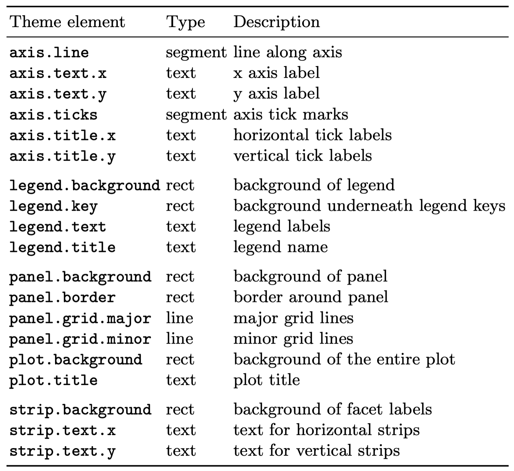
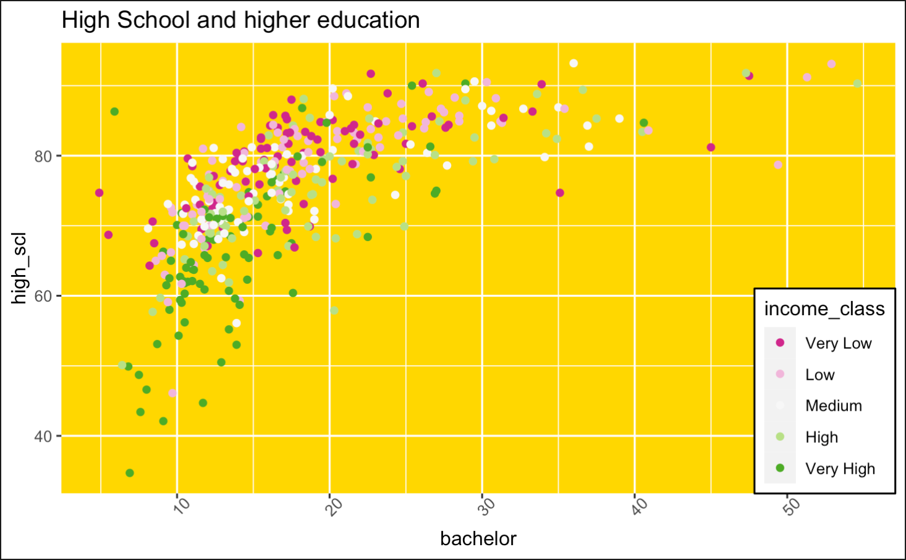
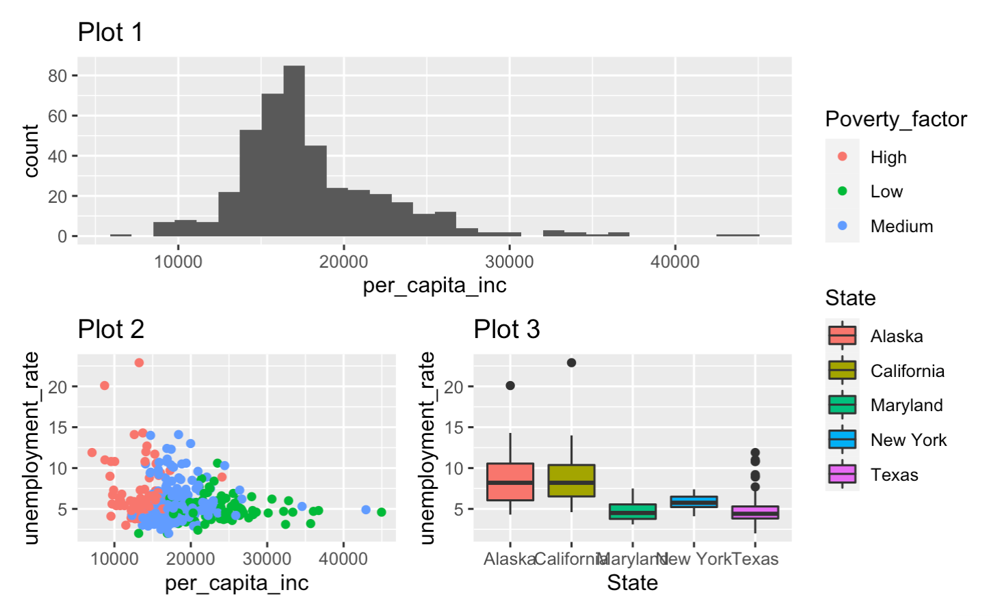

## Sissejuhatus

Siin praktikumis jätkame ggplot2 võimaluste õppimisega. Selleks, et tööga pihta saaks hakata, loeme sisse vajalikud paketid ja andmestiku.

```{r}
library(ggplot2)
library(tidyverse)

load("linnad.RData", verbose = T)
```

## Graafikute annoteerimine ja mugandamine

### Graafikute annoteerimine

Telgede ja graafiku annoteerimise viise me oleme juba töö käigus näinud. Paljud asjad saab ära lahendada erinevate skaleerimisfunktsioonide parameetritega. Siiski on paljudele neis olemas ka mugavamad vasted eraldiu funktsioonidega mis hoiavad trükkimist kokku. Neist olulisemad on 

-   `ggtitle()` - määrame graafiku pealkirja

-   `xlab()`, `ylab()` - telgede pealkirjad

-   `xlim()`, `ylim()` - telgede väärtusvahemiku määramine

### Graafikute stiil

Vahest on vaja muuta `ggplot2` graafikute üleüldist stiili või mõne elemendi väljanägemist. Näiteks on standardne `ggplot2` graafikute taust hall, mis ei ole alati parim lahendus. Seda on lihtne muuta käsuga `theme_bw` mis teeb tausta valgeks ja muudab ka portsu muude graafiku elementide värve ja kuju. Neid funktsioone on veel, tasub vaadata mida RStudio pakub, kui kirjutada algus `theme_` . Veel rohkem erinevaid teemasid on olemas paketis ggthemes või võite proovida näiteks

```{r}
ggplot(linnad, aes(x = per_capita_inc, y = unemployment_rate, colour = birth_class)) +
  geom_point() +
  theme_bw() 
```

Neid funktsioone on veel, tasub vaadata mida RStudio pakub, kui kirjutada algus `theme_` . Veel rohkem erinevaid teemasid on olemas paketis `ggthemes` (<https://yutannihilation.github.io/allYourFigureAreBelongToUs/ggthemes/>).

```{r}
library(ggthemes)
ggplot(linnad, aes(x = per_capita_inc, y = unemployment_rate, colour = birth_class)) +
  geom_point() +
  theme_wsj() 
```

Täpsemalt saab muuta konkreetseid elemente käsuga `theme`. Siin on terve ports parameetreid mis töötavad hierarhiliselt. Olulisemad on toodud järgmisel joonisel.



Nendele saabväärtuseks anda käske `element_text`, `element_line` ja `element_rect` vastavalt parameetri tüübile. Käskude `element_*` parameetrid vastavad suhteliselt täpselt sarnaste elementide grid paketis kasutatavatele parameetritele. Oluline funktsioon on ka element_blank mis vastava elementi lihtsalt ära kustutab.

```{r}
ggplot(linnad, aes(x = per_capita_inc, y = unemployment_rate, colour = birth_class)) +
  geom_point() +
  theme(panel.background = element_rect(fill = "pink"), panel.grid.minor = element_blank())
```

Väga oluline parameeter käsus theme on ka `legend.position`. Kui selle väärtuseks on `"none"` kustutatakse legend ära. Väärtused `"left"`, `"right"`, `"top"` ja `"bottom"` käituvad nagu võiks oodata . Andes ette kahe elemendilise vektori paigutab ta legendi graafiku ala sees vastavalt antud koordinaatidele, paralleelselt on hea kasutada ka `legend.justification` argumenti, mis võimaldab legendi paigutust täpsemalt kontollida.

```{r}
ggplot(linnad, aes(x = per_capita_inc, y = unemployment_rate, colour = birth_class)) +
  geom_point() +
  theme(legend.position = "none")
```

```{r}
ggplot(linnad, aes(x = per_capita_inc, y = unemployment_rate, colour = birth_class)) +
  geom_point() +
  theme(legend.position = "bottom")
```

```{r}
ggplot(linnad, aes(x = per_capita_inc, y = unemployment_rate, colour = birth_class)) +
  geom_point() +
  theme(legend.position = c(1,1), legend.justification = c(1, 1))
```

#### Ülesanded

-   Proovi saavutada umbes järgmine pilt.



```{r}
ggplot(linnad, aes(bachelor, high_scl, color = income_class))+
  geom_point() +
  theme(panel.background = element_rect(fill = "#FFD700"))+
  theme(legend.position = c(1,0.398), legend.justification = c(1, 1), legend.box.background = element_rect(color="black", size=1))+
  theme(axis.text.x = element_text(angle = 45))+
  scale_colour_brewer(type = "div", palette = 2) 
```


## Graafikute salvestamine

Grafikuid saab salvestada käsuga `ggsave()`, Kui ette anda vaid faili nimi, siis salvestab see käsk viimase graafiku, mis sai joonistatud, kusjuures suuruse võtab ta akna järgi ning failitüübi määrab faili nime laiendi järgi. Parameetreid `width` ja `height` kasutades on võimalik ära määrata ka täpselt joonise mõõdud (tollides).

```{r}
ggplot(linnad, aes(x = per_capita_inc, y = unemployment_rate, colour = Poverty_factor)) +
  geom_point() +
  theme(legend.position = c(1,1), legend.justification = c(1, 1))

ggsave("plot1.png")
ggsave("plot1.pdf")
ggsave("plot1_wide.png", width = 10, height = 5)
```

## Erinevate graafikute kokku panemine

Graafikute tahkudeks jagamine toimib väga hästi, kui me tahame ühte tüüpi graafikut jagada mitmeks. Kuid kui me tahame erinevat tüüpi graafikuid erinevatel muutujatel samal pildil kõrvuti näidata, siis sama lähenemine ei tööta. Siin tulevad appi lisapaketid. Näiteks `patchwork` on üks mis võimaldab `ggplot2` graafikuid kokku panna.

Enne, kui läheme `patchwork`-i enda juurde vaatame ühte kasulikku nippi. Nimelt on võimalik ggplot graafik muutujana salvetada. Joonistatakse see alles siis kui muutuja väärtus on vaja välja trükkida.

```{r}
p = ggplot(linnad, aes(x = per_capita_inc, y = unemployment_rate, colour = Poverty_factor)) +
  geom_point()

p
p + theme_bw()
```

Loeme sisse paketi patchwork ja defineerime kolm graafikut mida kombineerima hakata.

```{r}
library(patchwork)

p1 = ggplot(linnad, aes(x = per_capita_inc)) +
  geom_histogram() +
  ggtitle("Plot 1")
p2 = ggplot(linnad, aes(x = per_capita_inc, y = unemployment_rate, colour = Poverty_factor)) +
  geom_point() +
  ggtitle("Plot 2")
p3 = ggplot(linnad, aes(x = State, y = unemployment_rate, fill = State)) +
  geom_boxplot() +
  ggtitle("Plot 3")


p1
p2
p3
```

Patchworkis tehakse ka graafikutega "tehteid". Selleks, et graafikuid kõrvuti panna on tehe `|`.

```{r}
p1 | p2  
```

Üksteise alla saab panna graafikuid tehtega `/` .

```{r}
p1/p2
```

Tehteid saab ka kombineerida, siis tuleb tähelepanu juhtida tehete järjekorrale

```{r}
p1 | p2 / p3
```

```{r}
(p1 | p2) / p3
```

Selleks, et piltide paigutust paremini kontrollida on funktsioon `plot_layout`, millega saab joonise erinevaid aspekte muuta. Näiteks `heights` parameeter võimaldab muuta piltide suhtelisi kõrguseid.

```{r}
p1 / p2 / p3 + plot_layout(heights = c(2, 2, 4))
```

Argument widths töötab sama moodi.

```{r}
(p1 | p2 | p3) + plot_layout(widths = c(2, 2, 4))
```

Eelmine pilt jäi kole sest vastavate laiustega on graafikute andmeid näitavad paneelid. Kuna kahel graafikul on aga legend, siis nende laiust arvesse ei võeta. Küll aga on võimalik argumendiga guides kõikidelt piltidelt legendid kokku koguda.

```{r}
(p1 | p2 | p3) + plot_layout(widths = c(2, 2, 4), guides = "collect")
```

Paketis patchwork on veel palju võimalusi ja tasub uurida paketi kodulehte <https://github.com/thomasp85/patchwork> ja seal viidatud õpetusi.

#### Ülesanded

-   Proovige tekitada järgnev pilt


```{r}
p1 / (p2 | p3) + plot_layout(widths = c(4, 2, 2), guides = "collect")
```


## ggplot2-ga graafikute joonistamise harjutamine

Selle ja eelmise praktikumi põhjal peaks olulisemad oskused ggplot2 kasutamiseks olemas olema. Nüüd proovime neid rakendada, kasutades ka teadmisi teisest loengust, kus sai tutvustatud graafikute valimise põhimõtteid täpsemalt.

Loeme sisse kõigepealt andmestiku, mis kirjeldab siis 2000 inimese kehamassi indekseid ja juhuslikul päeval tehtud sammude arvu. Iga inimese kohta on ka antud sugu, vanus ja vanusegrupp. Loeme andmestiku sisse.

```{r}
load("bmi.RData", verbose = T)

bmi
```

Iga ülesande puhul tasub proovida erinevaid variante ja mõelda milline töötab antud olukorras paremini ja miks. Meeldetuletuseks, siin on olulisemad käsud mida vaja võib minna

-   `geom_point`

-   `geom_histogram`

-   `geom_bar`

-   `geom_boxplot`

-   `geom_density`

-   `geom_violin`

-   `geom_smooth`

-   `facet_grid`

#### Ülesanded

-   Milline tehtud sammude jaotus? Millist geomeetrilist esitust võib selle uurimiseks kasutada?

-   Milline on tehtud sammude jaotus sugude kaupa? Vihjed:

    -   et joonistada histogrammid üksteise peale tasub panna `position = "identity"`

    -   argument `alpha` kontrollib värvide läbipaistvust

-   Kumma soo esindajad teevad mediaanis vähem sammusid?

-   Tee läbi see sama võrdlus vanusegruppide kaupa. Kas järeldus on sama?

-   Vaata vanusegruppide arvukust sugude kaupa. Kas jaotus on sarnane või erinev?

-   Kas vanuse ja tehtud sammude vahel on seos? Kas seos tundub lineaarne?

-   Milline on seos kehamassi indeksi ja sammude vahel? Kas seos on lineaarne ja või on tegu millegi keerukamaga?

## Kodune ülesanne

Meil on andmestik erinevate maailma riikide ning nende sotsiaalsete indeksite kohta. See andmestik on failis `countries.RData` mis on kaasas praktikumi materjalidega. Sellel andmestikul tuleks uurida küsimust, kas ja milline on seos laste arvul naise kohta (`child_per_woman`) oodatava elueaga (`life_expectancy`). Sealjuures tuleks pildil arvesse võtta ka riikide populatsiooni (`population_total`), maailmajagu (`region`) ning jaotust sissetuleku järgi (`income_groups`). Kõik muutujad võib panna ühele pildile või võib kombineerida ka mitmest panellist patchworki kasutades. Kuna andmed on keerukad võib pildi salvestada suuremana (kasutades käsku `ggsave` ja argumente `height` ja `width`), et kõigel vajalikul piisavalt ruumi oleks.

Esitada tuleb graafikut genereeriv **kood** ja ka mõne lauseline **järeldus**, mille te pildilt olete välja lugenud.

```{r}
load("countries.RData", verbose = T)
```

```{r}
library(sjmisc)

#populatsioonid kvantiilide põhjal 5ks kategooriaks
countries$pop_grouped <- split_var(countries$population_total, n = 4) 

#eralduskohad
splits <- prettyNum(quantile(countries$population_total, c(.25,.50,.75,1), names = FALSE),big.mark=",", scientific = FALSE) 

#Kategooriate nimed
nimed <- c(paste0("0-",splits[1]),
           paste0(splits[1],"-",splits[2]),
           paste0(splits[2],"-",splits[3]),
           paste0(splits[3],"-",splits[4]))

countries$pop_grouped <- factor(countries$pop_grouped, labels = nimed) 

ggplot(countries, aes(x=child_per_woman, y = life_expectancy))+
  geom_point()+
  geom_smooth(method="lm")+
  xlab(label = "Lapsi naise kohta")+
  ylab(label = "Oodatav eluiga")+
  theme_bw()

  ggplot(countries, aes(x=child_per_woman, y = life_expectancy, color = income_groups))+
    geom_point(aes(shape = region))+
    geom_smooth(aes(fill = income_groups), method="lm")+
    xlab(label = "Lapsi naise kohta")+
    ylab(label = "Oodatav eluiga")+
    scale_colour_brewer(type = "seq", palette = 2)+
    scale_fill_brewer(type = "seq", palette = 2)+
    theme(panel.background = element_rect(fill = "black"))

ggplot(countries, aes(x=child_per_woman, y = life_expectancy, color = region))+
  geom_point(aes(size = population_total))+
  geom_smooth(aes(fill = region), method="lm")

ggplot(countries, aes(x=child_per_woman, y = life_expectancy, color = pop_grouped))+
  geom_point()+
  geom_smooth(aes(fill = pop_grouped), method="lm")
```


Hindame järgnevaid aspekte

-   Järelduse asjakohasus ja kui lihtne on seda pildiga kokku viia

-   Graafiku(te) joonistamisel tehtud valikute asjakohasus

-   Graafilised detailid ja nende valik

    -   Värviskaalad

    -   Diskreetsete muutujate järjekord

    -   Kõik tekstid pildil võiksid olla kergesti loetavad (suurte tähtedega, grammatiliselt korrektsed, piisavalt kirjeldavad)
